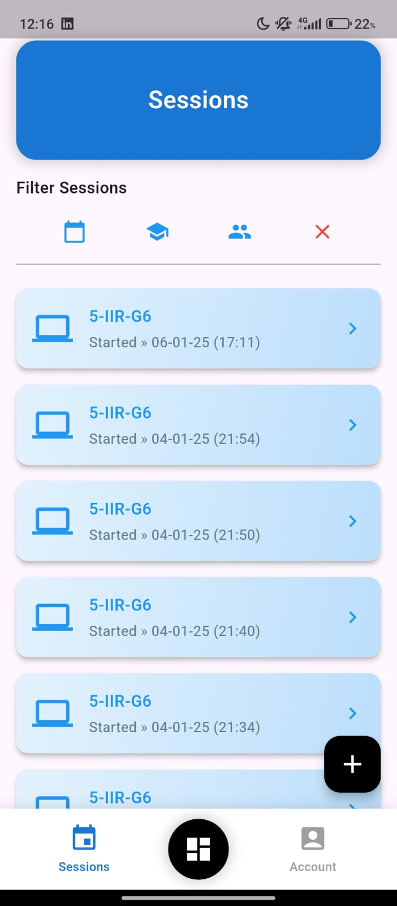

# 

# Identifyer - Face Recognition Attendance System

Identifyer is a comprehensive facial recognition-based attendance system designed to streamline and automate attendance tracking in educational institutions. By utilizing real-time facial recognition technology, Identifyer enhances accuracy, reduces administrative tasks, and securely manages attendance data through Supabase.

---

## Project Overview
Identifyer leverages:
- **Frontend:** Flutter (Dart) for building a cross-platform mobile application.
- **Backend:** Python WebSocket Server integrated with DeepFace for facial recognition.
- **Database:** Supabase (PostgreSQL) for data storage and user management.
- **Real-time Communication:** WebSocket protocol facilitates image transfer and recognition results.
- **Storage:** Supabase storage buckets hold session exports and student images.

---

## Key Features
- **Real-time Attendance:** Automatic logging of student attendance using live facial recognition.
- **Secure Storage:** Supabase buckets store student images and session attendance reports.
- **Role-based Access Control:** Admins and teachers have different levels of access to manage users, sessions, and attendance data.
- **Session Reports:** Sessions export attendance data as Excel sheets for record-keeping and analysis.

---

## System Architecture
1. **Flutter Frontend**
   - Captures student images during sessions.
   - Displays real-time attendance status.
   - Manages session creation and student enrollment.

2. **WebSocket Backend**
   - Receives and processes images from the app.
   - Generates embeddings using DeepFace.
   - Returns recognition results for attendance logging.

3. **Supabase Database**
   - Stores user, student, session, and attendance data.
   - Utilizes storage buckets for images and session exports.

4. **Supabase Storage Buckets**
   - **studentinformation**: Stores student profile images used for facial recognition.
   - **sessions**: Stores exported session reports in Excel format.

---

## Workflow
### 1. Student Enrollment
- Admins create student records by filling in personal details and uploading a photo.
- The photo is sent to the WebSocket server to generate facial embeddings.
- The image is uploaded to the `studentinformation` bucket.
- A complete student record, including embeddings, is saved in the database.

### 2. Session Creation
- Teachers create new sessions specifying the relevant class group and course information.

### 3. Attendance Marking
- During the session, the app continuously captures and sends face data to the WebSocket server.
- Matches are logged in the `Attendance` table.

### 4. Report Generation
- Upon session completion, attendance data is exported as an Excel sheet and stored in the `sessions` bucket.

---

## Setup Guide
### Prerequisites
- **Flutter SDK** installed.
- **Python 3.x** installed.
- **Supabase Account** with storage and database configured.
- **DeepFace** Python library installed.

---

### 1. Clone the Repositories
```bash
git clone https://github.com/YourRepo/Identifyer-frontend.git
git clone https://github.com/YourRepo/Identifyer-websocket.git
```

---

### 2. Set Up WebSocket Server
```bash
cd Identifyer-websocket
python -m venv venv
source venv/bin/activate  # On Windows use venv\Scripts\activate
pip install -r requirements.txt
python server.py
```

---

### 3. Configure Supabase
1. Create a new project in Supabase.
2. Set up the following storage buckets:
   - **studentinformation**: To store student images.
   - **sessions**: To store exported session reports.
3. Go to the **SQL Editor** in Supabase and create the following tables:
   - **Students Table**:
     ```sql
     CREATE TABLE students (
       id UUID PRIMARY KEY,
       first_name TEXT,
       last_name TEXT,
       year INT2,
       specialty TEXT,
       group TEXT,
       email TEXT,
       phone TEXT,
       embeddings JSONB,
       created_at TIMESTAMP DEFAULT now(),
       isMale BOOLEAN
     );
     ```
   - **Sessions Table**:
     ```sql
     CREATE TABLE sessions (
       id UUID PRIMARY KEY,
       year TEXT,
       specialty TEXT,
       group TEXT,
       start_time TIMESTAMP,
       end_time TIMESTAMP,
       created_at TIMESTAMP DEFAULT now(),
       status TEXT,
       teacher UUID REFERENCES users(id)
     );
     ```
   - **Attendance Table**:
     ```sql
     CREATE TABLE attendance (
       id UUID PRIMARY KEY,
       student_id UUID REFERENCES students(id),
       session_id UUID REFERENCES sessions(id),
       timestamp TIMESTAMP,
       status TEXT,
       created_at TIMESTAMP DEFAULT now()
     );
     ```
4. Create a `.env` file in the Flutter project root directory with the following variables:
```
SUPABASE_URL=https://<your-supabase-url>.supabase.co
SUPABASE_KEY=<your-supabase-key>
WEBSOCKET_URL=ws://<your-websocket-ip>:8765
```


---

### 4. Run the Flutter Application
```bash
cd Identifyer-frontend
flutter pub get
flutter run
```

---

## Page Previews
### Admin Dashboard

- Overview of session activities, attendance data, and quick access to management tools.

### Admin Sessions

- View, manage, and export session records.

### Admin Students

- Manage student data including adding, updating, or removing students.

### Admin Teachers

- Manage teacher accounts and assign class sessions.

### Teacher Dashboard

- Teachers can start new sessions and track attendance in real time.

### Teacher Sessions

- Review attendance data from past sessions.

### Login Page

- Secure login for both admins and teachers.

### Home Page

- Overview of the app with quick navigation to various sections.

---

## Security and Best Practices
- **Environment Variables:** Store sensitive keys and URLs in a `.env` file.
- **Supabase Access Control:** Implement role-based access control to limit bucket access.
- **Data Encryption:** Ensure all data in Supabase is encrypted both at rest and in transit.

---

## Conclusion
Identifyer simplifies attendance tracking through advanced facial recognition technology, enhancing efficiency for educational institutions. This guide covers the full implementation process, from setting up the WebSocket server to configuring Supabase for storage. By following these steps, you can deploy a fully operational facial recognition attendance system.

